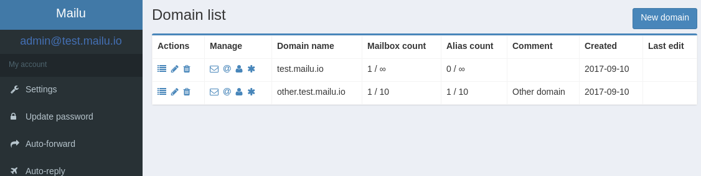

Mailu is a simple yet full-featured mail server as a set of Docker images.
It is free software (both as in free beer and as in free speech), open to
suggestions and external contributions. The project aims at providing people
with an easily setup, easily maintained and full-featured mail server while
not shipping proprietary software nor unrelated features often found in
popular groupware.

Most of the documentation is available on our [Website](https://mailu.io),
you can also [try our demo server](https://mailu.io/master/demo.html)
before setting up your own, and come [talk to us on Matrix](https://matrix.to/#/#mailu:tedomum.net).

Features
========

Main features include:

- **Standard email server**, IMAP and IMAP+, SMTP and Submission with auto-configuration profiles for clients
- **Advanced email features**, aliases, domain aliases, custom routing, full-text search of email attachments
- **Web access**, multiple Webmails and administration interface
- **User features**, aliases, auto-reply, auto-forward, fetched accounts, managesieve
- **Admin features**, global admins, announcements, per-domain delegation, quotas
- **Security**, enforced TLS, DANE, MTA-STS, Letsencrypt!, outgoing DKIM, anti-virus scanner, [Snuffleupagus](https://github.com/jvoisin/snuffleupagus/), block malicious attachments
- **Antispam**, auto-learn, greylisting, DMARC and SPF, anti-spoofing
- **Freedom**, all FOSS components, no tracker included

Contributing
============

Mailu is free software, open to suggestions and contributions. All
components are free software and compatible with the MIT license. All
specific configuration files, Dockerfiles and code are placed under the
MIT license.
