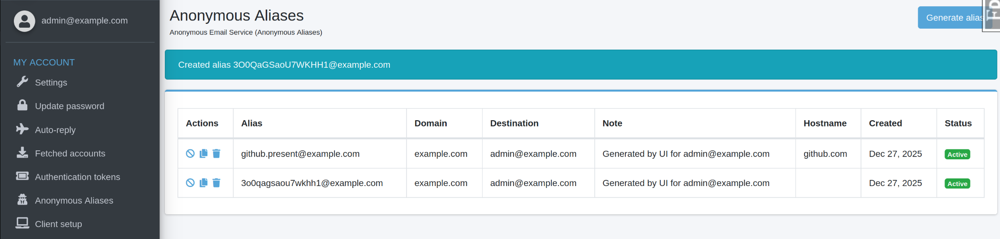
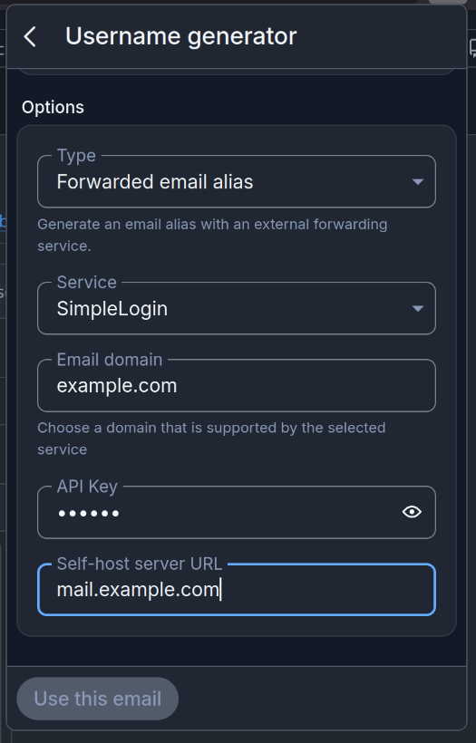

Anonymous Email Service
=======================

Overview
--------

Mailu includes an Anonymous Email Service (Anonmail) that generates random email
aliases. The feature provides both a web interface and an API compatible with
password managers like Bitwarden. The API follows the SimpleLogin model.

Features:

- Random alias generation via admin UI or API
- Optional hostname-based alias prefixes (e.g. ``github.alpha@example.com``)
- Per-domain access control

Administration
--------------

Domain configuration
~~~~~~~~~~~~~~~~~~~~

Enable Anonymous Email Service in the domain settings. Each domain has an
individual toggle. This enables the Anonmail feature for that domain for any user.
Individual domain access can be granted in the domain access function by a domain
manager or global admin.

Personal Alias management
~~~~~~~~~~~~~~~~~~~~~~~~~

The alias list displays Anonmail-generated aliases with additional metadata:

Aliases can be disabled or deleted directly from the interface.

API Usage
---------

Authentication
~~~~~~~~~~~~~~

Create a personal token under "Authentication tokens" in the admin
interface. The authentication header takes its ``TOKEN`` in the format of ``<user-email>:<auth-token>``.

Requirements:

- Valid application token
- Anonmail enabled on target domain
- Domain ownership or explicit access grant

Endpoint
~~~~~~~~

``POST /api/alias/random/new``

**Headers:**

- ``Authentication: <TOKEN>``

**Parameters:**

- ``hostname`` (query string, optional): Website hostname for alias prefix generation
- ``note`` (JSON body, optional): Alias description
- ``destination`` (JSON body, optional): Forwarding address (string or array)

**Example:**

.. code-block:: bash

  TOKEN="user-email:your-auth-token"
  curl -X POST "https://admin.example.com/api/alias/random/new?hostname=www.github.com" \
    -H "Authentication: ${TOKEN}" \
    -H "Content-Type: application/json" \
    -d '{"note":"GitHub signup"}'

**Response:**

The API returns the created alias in JSON format.

Bitwarden Integration
~~~~~~~~~~~~~~~~~~~~~

Integration with the Bitwarden password manager allows automatic alias generation during username creation.

Select "Forwarded email alias" as source for the username generator and supply an Email domain, your ``TOKEN``, and the Mailu admin interface domain.
As seen below:

Behavior
--------

Aliases created through Anonmail function as standard Mailu aliases. Incoming
mail is forwarded to configured destination addresses. Disabling an alias stops
mail delivery.

Destination addresses must belong to the token owner. Arbitrary forwarding
addresses are not permitted.

Troubleshooting
---------------

**403 / 401 errors**
  Verify token validity, domain Anonmail status, and access permissions.

**404 errors**
  Confirm the domain has Anonmail enabled and the alias exists.

**Cannot create aliases**
  Check domain Anonmail status and domain access grants.

**Mail not delivered**
  Verify the alias is enabled and destination addresses exist in Mailu.