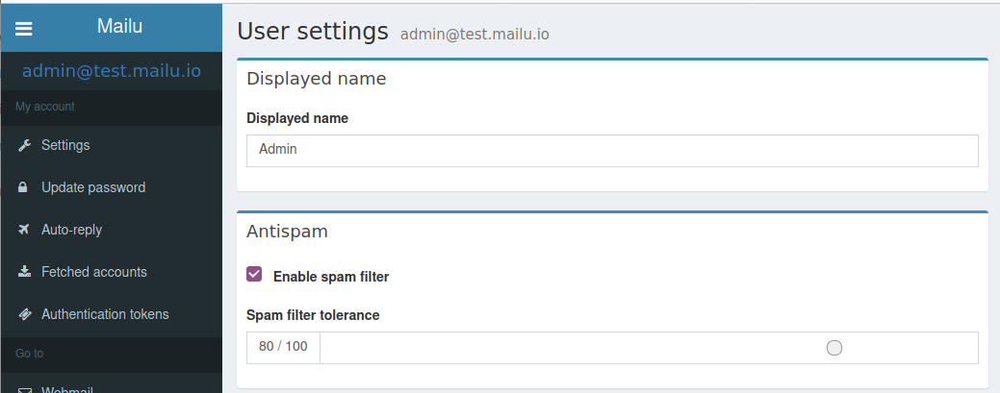

Spam filtering
==============

.. _antispam_howto:

How does spam filtering work in Mailu?
--------------------------------------

Mailu uses Rspamd for spam filtering. Rspamd is a Fast, free and open-source spam filtering system.

Rspamd rejects non-compliant email messages and email messages that contain viruses. In Mailu Rspamd uses a scoring scale from 0 to 15. The following values are the default values, and can be changed inside the Rspamd WebUI under the tab configuration:

* Email messages with a score of 15 or higher will be rejected.

* Email messages with a score of 6 or higher will receive a header with the spam score.

* Email messages with a score of 4 or higher will be greylisted.

* Email messages with a score of 3 or lower will be accepted.

1. When an email message is received or send by Postfix, it is scanned by Rspamd. If the email message receives a spam score between 6 and 15, a header is added to the email message with the spam score. This is an example of an email header for a spam score of 14::

    X-Spamd-Bar: ++++++++++++++
    X-Spam-Level: **************
    Authentication-Results: test.mailu.io;
       dkim=pass header.d=example.com header.s=mailing header.b=ABCDE;
       dkim=pass header.d=example.com header.s=mailing header.b=ABCDE;
       dmarc=pass (policy=none) header.from=eventim.de;
       spf=pass (test.mailu.io: domain of return@example.com designates 11.22.33.44 as permitted sender) smtp.mailfrom=return@example.com
    X-Spam: Yes

2. Dovecot is then responsible for classifying the email message to the Junk folder based on user preferences. It works as following:

   * In the administration web interface, under settings under Antispam 'Enable spam filter' must be ticked. If this option is disabled, then all email messages will automatically go to the inbox folder. Except for email messages with a score of 15 or higher, as these email messages are rejected by Rspamd.

   * In the administration web interface, under settings under Antispam, the user defined spam filter tolerance must be configured. The default value is 80%. The lower the spam filter tolerance, the more false positives (ham classified as spam). The user can change this setting to finetune when an email message is classified as spam.

   * Dovecot extracts the X-Spam-Level email header from the email message and converts the spam score (0 - 15) to a 0 - 100 percent scale. This spam score is compared with the user defined spam filter tolerance. If the spam score is lower than the user defined spam filter tolerance, then the email message is accepted. In logic:

     If <spam_score in percent> is greater than <spam filter tolerance>, then move the email message to the spam folder and mark the email message as read.

   For example if the user defined spam filter tolerance is set to 80%(default) and the spam score of an email message is 10:

   66% (10/15) is less than 80%, so the email is classified as ham. This email message will go to the inbox folder. If the user wants email messages with a score of 10 (66%) to be classified as spam, then the user defined spam filter tolerance can be lowered to 65% in the administration web interface.

   The default spam filter tolerance used for new users can be configured using the environment variable ``DEFAULT_SPAM_THRESHOLD``. See also :ref:`common_cfg` in the configuration reference.

The location in the administration web interface where the spam filter and spam filter tolerance can be configured.

*Issue reference:* `1167`_.

Can I learn ham/spam messages from an already existing mailbox?
---------------------------------------------------------------

Mailu supports automatic spam learning for email messages moved to the Junk Folder. Any email messages moved to the Junk Folder will be re-learned as spam, any email moved from the Junk Folder to any other folder (but the trash folder) will be re-learned as ham.

If you already have an existing mailbox and want Mailu to learn them all as ham messages, you might run rspamc from within the dovecot container:

.. code-block:: bash

  rspamc -h antispam:11334 -P mailu -f 13 fuzzy_add /mail/user\@example.com/.Ham_Learn/cur/
  rspamc -h antispam:11334 -P mailu learn_ham /mail/user\@example.com/.Ham_Learn/cur/

This should learn every file located in the ``Ham_Learn`` folder from user@example.com

Likewise, to learn all messages within the folder ``Spam_Learn`` as spam messages :

.. code-block:: bash

  rspamc -h antispam:11334 -P mailu -f 11 fuzzy_add /mail/user\@example.com/.Spam_Learn/cur/
  rspamc -h antispam:11334 -P mailu learn_spam /mail/user\@example.com/.Spam_Learn/cur/

*Issue reference:* `1438`_.

.. _antispam_howto_block:

How can I block emails from a domain?
-------------------------------------

Via the multimap filter it is possible to block emails from a sender domain. See the `official rspamd documentation`_ for more information. A local blacklist that contains the domains to be blocked can be configured via the :ref:`Rspamd overrides folder <override-label>`.

The following steps have to be taken to configure an additional symbol (rule) that uses the multimap filter to block emails from sender domain.

1. In the overrides folder create a configuration file for the multimap filter. This configuration is included by Rspamd in the main multimap configuration file. This means you do not have to use the "multimap {}" element. Files in the /mailu/overrides/rspamd/ folder are mapped to /etc/rspamd/override.d.
   Create the file /mailu/overrides/rspamd/multimap.conf with contents:

   .. code-block:: bash

    #override.d/multimap.conf
    #Tip: Each setting must be closed with a semi-colon ';'.
    local_bl_domain {
      type = "from";
      filter = "email:domain";
      map = "/etc/rspamd/override.d/blacklist.inc";
      score = 14;
      description = "Senders domain part is on the local blacklist";
      group = "local_bl";
      action = "reject";
    }

   Note the "action = "reject";" line. This is a so-called pre-filter. No further filters/rules are processed when a pre-filter is used. If you omit this line, then the configured score will be added to the total score of the email message. Depending on the end-score after processing all rules, a verdict is made. To override this, you can add the action line. When this symbol (rule) is fired, then this action is immediately taken and no further processing occurs. You can use the following actions:

   * discard: drop an email message, but return success for sender (should be used merely in special cases)

   * reject: reject the email message. This enables the actual blocking of mails from the domain.

   * add header: add email header to indicate spam. This always adds the spam score to the email message. Depending on the user defined spam filter tolerance, the email message is moved to the Inbox folder or Junk folder.

   * no action: allow message. The email message will be allowed without a spam score being added in the mail header. This can be used for creating a whitelist filter.

   * soft reject: temporarily delay message (this is used, for instance, to greylist or ratelimit messages)

   To move an email message to the Junk (Spam) folder, a score of 15 can be used in combination with the action "add header".
   The above example configuration will reject all emails send from domains that are listed in '/etc/rspamd/override.d/blacklist.inc'.

2. In the Rspamd overrides folder create a map that contains the domains to be blocked. You can use # to add comments.
   Create the file /mailu/overrides/rspamd/blacklist.inc with the following contents:

   .. code-block:: bash

     #Blacklisted domains. All emails from these domains are blacklisted and will be rejected.
     #This file is LIVE reloaded by rspamd. Any changes are EFFECTIVE IMMEDIATELY.
     dummy.com

3. Reload Rspamd by stopping the Rspamd container and starting the Rspamd container again. Example for docker-compose setup:

   .. code-block:: bash

     docker-compose scale antispam=0
     docker-compose scale antispam=1

4. (Optional) Check if the custom symbol is loaded. To access the Rspamd webgui, log in the Mailu administration web interface with a user that is an administrator and go to Antispam. In Rspamd webgui go to tab Symbols. Change the group drop-down box to local_bl. The following additional rule will be listed.

   .. image:: assets/screenshots/RspamdSymbolBlacklist.png

   The symbol is only displayed if the symbol has no pre-filter (action= line) configured. Changes made in this screen are not saved to the configuration file.

5. Check if the map is available. In rspamd webgui to to configuration. A map is available with the path:
   /etc/rspamd/override.d/blacklist.inc	Senders domain part is on the local blacklist

   .. image:: assets/screenshots/RspamdMapBlacklist.png

   When clicking on this map, you can live-edit the map via the GUI. Changes are effective immediately. Only changes made to maps in the overrides folder are persistent. Changes made to other maps will be reverted when the Rspamd container is recreated. It is also possible to make direct changes to the map on filesystem. These changes are also effective immediately.

For more information on using the multimap filter see the official `multimap documentation`_ of Rspamd.

.. _`official rspamd documentation`: http://rspamd.com/doc/modules/multimap.html#from-rcpt-and-header-filters
.. _`multimap documentation`: https://rspamd.com/doc/modules/multimap.html

*Issue reference:* `1566`_.

.. _`1438`: https://github.com/Mailu/Mailu/issues/1438
.. _`1167`: https://github.com/Mailu/Mailu/issues/1167
.. _`1566`: https://github.com/Mailu/Mailu/issues/1566

Can I change the list of authorized file attachments?
-----------------------------------------------------

Mailu rejects emails with file attachements it deems to be "executable" or otherwise dangerous. If you would like to tweak the block list, you can do so using the following commands:

   .. code-block:: bash

     docker-compose exec antispam cat /etc/rspamd/local.d/forbidden_file_extension.map > overrides/rspamd/forbidden_file_extension.map
     docker-compose restart antispam

Now the file `overrides/rspamd/forbidden_file_extension.map` can be edited, to make changes to the forbidden file extensions list.
For the changes to take effect, rspamd must be restarted.

Mailu rejects emails with documents attached containing some macros. How can I fix it?
--------------------------------------------------------------------------------------

If configured to do so, Mailu uses a lightweight tool called `mraptor from oletools`_ to scan documents containing macros. By default only macros deemed potentially harmful are blocked, but there may be false positives. If you want to change the default behaviour, you may need to override the ``/etc/rspamd/local.d/composites.conf`` file in the antispam container. The following commands may be useful:

   .. code-block:: bash

     docker-compose exec antispam cat /etc/rspamd/local.d/composites.conf > overrides/rspamd/composites.conf
     docker-compose restart antispam

Now the file `overrides/rspamd/composites.conf` can be edited, to override the mraptor configuration in rspamd.
For the changes to take effect, rspamd must be restarted.

.. _`mraptor from oletools`: https://github.com/decalage2/oletools/wiki/mraptor
