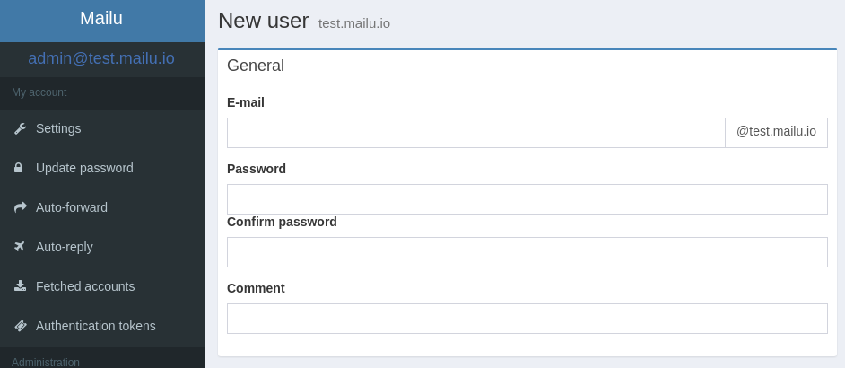

Mailu
=====

.. image:: assets/logo.png

|

.. image:: https://img.shields.io/github/stars/mailu/mailu.svg?label=github&logo=github&maxAge=2592000
   :target: https://github.com/mailu/mailu

.. image:: https://img.shields.io/docker/pulls/mailu/admin.svg?label=docker&maxAge=2592000
   :target: https://hub.docker.com/u/mailu/

.. image:: https://img.shields.io/badge/matrix-%23mailu%3Atedomum.net-7bc9a4.svg
   :target: https://matrix.to/#/#mailu:tedomum.net

Mailu is a simple yet full-featured mail server as a set of Docker images.
It is free software (both as in free beer and as in free speech), open to
suggestions and external contributions. The project aims at providing people
with an easily setup, easily maintained and full-featured mail server while
not shipping proprietary software nor unrelated features often found in
popular groupware.

Main features include:

- **Standard email server**, IMAP and IMAP+, SMTP and Submission with autoconfiguration profiles for clients
- **Advanced email features**, aliases, domain aliases, custom routing
- **Web access**, multiple Webmails and administration interface
- **User features**, aliases, auto-reply, auto-forward, fetched accounts
- **Admin features**, global admins, announcements, per-domain delegation, quotas
- **Security**, enforced TLS, DANE, MTA-STS, Letsencrypt!, outgoing DKIM, anti-virus scanner, [Snuffleupagus](https://github.com/jvoisin/snuffleupagus/), block malicious attachments
- **Antispam**, auto-learn, greylisting, DMARC and SPF, anti-spoofing
- **Freedom**, all FOSS components, no tracker included

The documentation is written as part of the repository and evolves with it.
Make sure that you access the proper version of the documentation, based on
the version of Mailu that you are running.

.. toctree::
   :maxdepth: 2
   :caption: General

   general
   features
   faq
   releases
   demo

.. toctree::
    :maxdepth: 2
    :caption: Setup

    setup
    compose/requirements
    compose/setup
    kubernetes/mailu/index
    configuration
    dns
    reverse
    database
    arm_images

.. toctree::
    :maxdepth: 2
    :caption: Administration

    maintain
    webadministration
    antispam
    cli

.. toctree::
    :maxdepth: 2
    :caption: Contributors

    contributors/workflow
    contributors/guidelines
    contributors/environment
    contributors/database
    contributors/memo
    contributors/localization
